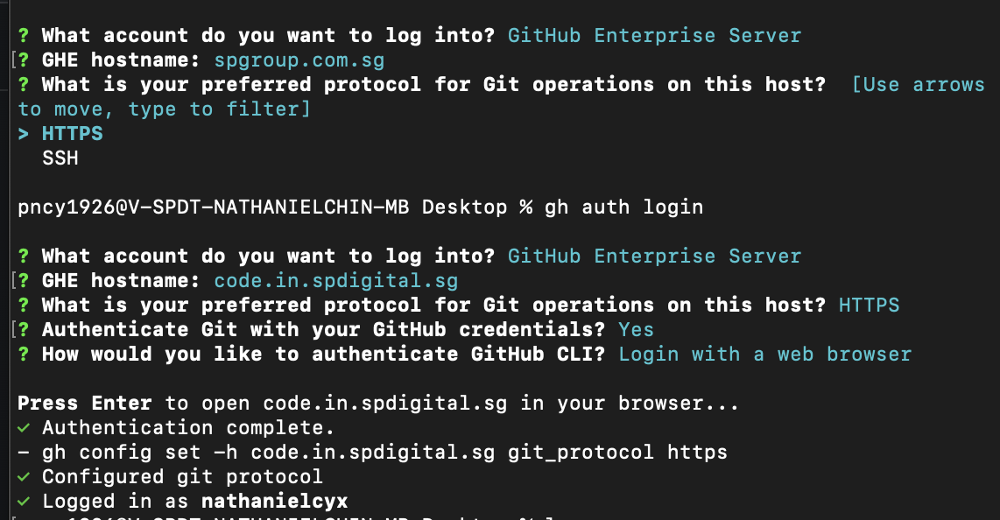
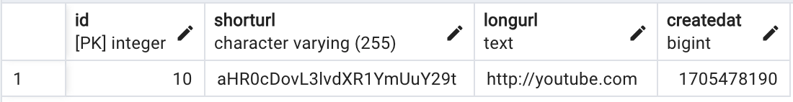
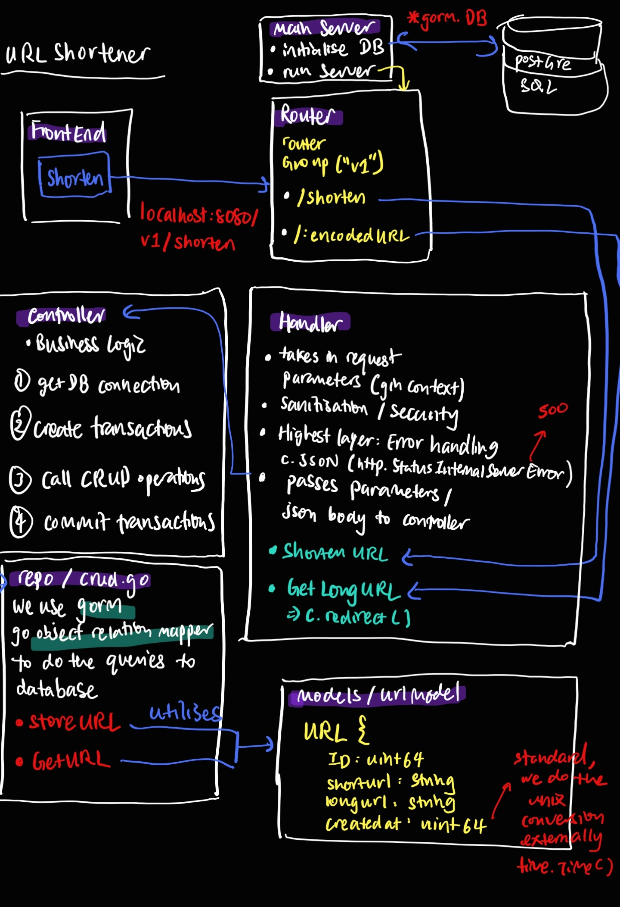

## cloning a repo
for mac download github cli
```bash
brew install gh
```

try to clone into a workspace folder from the root user directory

then for api, npm start
for web and admin uis, npm run dev

## git flow cheatsheet
init is the master branch
when developing features, create a branch named "feature/featurename"
hotfixes are branches that merge direct into production
https://danielkummer.github.io/git-flow-cheatsheet/

## commands to run the server/api
```bash
go get .
go run .
```

OR 

```bash
go get .
go build
./urlshortener
```
### for running more than 1 file
go run main.go server.go
do note go run main.go will not work as it does not see server.go as part of the same package

## commands to run the frontend
```
cd frontend
npm install
npm start  
```


## curl commands to test api
### Create a shortened url
```bash
curl http://localhost:8080/v1/shorten \
    --include \
    --header "Content-Type: application/json" \
    --request "POST" \
    --data '{"longurl": "www.google.com"}'
```

```bash
curl http://localhost:8080/v1/shorten \
    --include \
    --header "Content-Type: application/json" \
    --request "POST" \
    --data '{"longurl": "twitter.com"}'
```

```bash
curl http://localhost:8080/v1/shorten \
    --include \
    --header "Content-Type: application/json" \
    --request "POST" \
    --data '{"longurl": "falsetest not url"}'
```

### Retrieve a long url
- do note here we include the `-i` tag to see the Location headers to see if the redirect works
```bash
curl http://localhost:8080/v1/<insert shortened url>
curl -i http://localhost:8080/v1/aHR0cDovL3d3dy5nb29nbGUuY29t
```


## sql query to make schema
```sql
CREATE TABLE urls (
    id SERIAL PRIMARY KEY,
    shorturl VARCHAR(255) UNIQUE NOT NULL,
    longurl TEXT NOT NULL,
    createdat BIGINT DEFAULT EXTRACT(EPOCH FROM CURRENT_TIMESTAMP)::BIGINT
);
```

```sql
SELECT * FROM public.urls
ORDER BY id ASC 
```


## sql query to index shorturl
since we need to often search for clashes in shorturl
```sql
-- Index for the shorturl column to speed up retrieval
CREATE INDEX idx_shorturl ON urls (shorturl);
```

## Architecture


## notes on the http codes
404 means the route is not found
200 is a successful http request e.g. if you send a post
500 means exception in the program
302 server is responding with an HTTP Found status code, instructing the client to redirect to the specified longURL.

## notes to import packages within same module
go under go.mod to see your module name
then you can import any of your packages via:
<modulename>/<relative-filepath-from-module-root>

## vs code shortcuts
cmd+P opens the file search bar
cmd+shift+P oepns the vscode command bar, for installing packages etc
cmd+shift+L edits the same words at the same time

## create react project
```
npx create-react-app url-shortener-frontend
cd url-shortener-frontend
```

## notes on singleton principle for the use of db connection object
https://refactoring.guru/design-patterns/singleton

## expiration of old data
Use a cron job
We store a createdAt field. After 30 days, any entries will be deleted.
Our background goroutine will run a cleanup every 24 hours.

## context
ctx has a session scope and is immutable
it is passed through the function call stack
used for tracing purposes => look into go jaegar
used also for testing => you can add params into it, where functions can check the ctx for these params, then execute specific functions


## unit testing design
always start with bottom layer of the code for testing
=> e.g. repo layer

start with valid cases
invalid:
- missing parameter
- invalid parameter
- internal errors

### test driven development
means you start with the functional requirements, then write functions to test first
once you are done with writing the test functions
then you start implementing the code with the functionality
tests are written before the implementation

### write a test suite:
https://medium.com/nerd-for-tech/testing-rest-api-in-go-with-testify-and-mockery-c31ea2cc88f9
=> initialisation before running tests
testify suite
the setupSuite (one file) runs before the whole group of tests
setupTest is run before each test
teardownSuite
teardownTest

### Freeze time for time testing:
possibility, have a global time, e.g. globalTime := time.now()
then in your code use the globalTime
except in your tests, you change globalTime to something else, this freezes time.
OR
can use frameworks like clockwork

### File Labelling:
every file will have the same name + "_test"

## Mocking in Testing
Mocking Frameworks:
- gomock or mockery

### Purpose of mocking
Mocking is not as useful in the case of testing a repo layer as you have control over
creating the struct for your models

Instead,
Purpose of mocking:
E.g controller function calls a CRUD function

This CRUD function may return varying results if I use its actual implementation, which could then affect the tests of my controller function.
As such I mock this CRUD function to give me a specific result that I want (.EXPECT) so that it provides a fixed environment that allows me to run tests for my controller


### When to use a real testDB connection for testing VS mocking the database?

#### Mock DB
Some deployment pipelines may require all your test cases to pass before deploying, and the pipeline may not support connecting to the DB as such in such situations you use mocking of the DB

#### Using Real DB
A solution to the above problem is to have a docker server run the DB in the pipeline which you then connect to, but this will make the pipeline heavy

However if the culture is such that you do testing and ensure all test cases pass before pushing to production, then in such a scenario you can use a testDB, testing locally before pushing

### Mockgen
mockgen is used in gomock to generate mocks
https://github.com/golang/mock#installation
- go install github.com/golang/mock/mockgen@v1.6.0
- nano ~/.zshrc
then paste:
- export PATH=$PATH:/Users/pncy1926/go/bin
- my username is pncy1926

#### Creating mocks with mock gen
Lets say we want to mock our repo layer functions, crud.go 
This is because we want to do testing in our controller layer which depends on the repo layer
1. At the root of our folder project urlshortener, where our main.go file is:
2. mockgen -source=repo/urlrepo/crud.go -destination=repo/urlrepo/mocks/crud_mock.go
- note: the source is the file we want to mock
3. These generated mock interfaces are just empty shells, you will have to use EXPECT() on it:
```go
(1) Define an interface that you wish to mock.
      type MyInterface interface {
        SomeMethod(x int64, y string)
      }
(2) Use mockgen to generate a mock from the interface.
(3) Use the mock in a test:
      func TestMyThing(t *testing.T) {
        mockCtrl := gomock.NewController(t)
        defer mockCtrl.Finish()

        mockObj := something.NewMockMyInterface(mockCtrl)
        mockObj.EXPECT().SomeMethod(4, "blah")
        // pass mockObj to a real object and play with it.
      }
```


