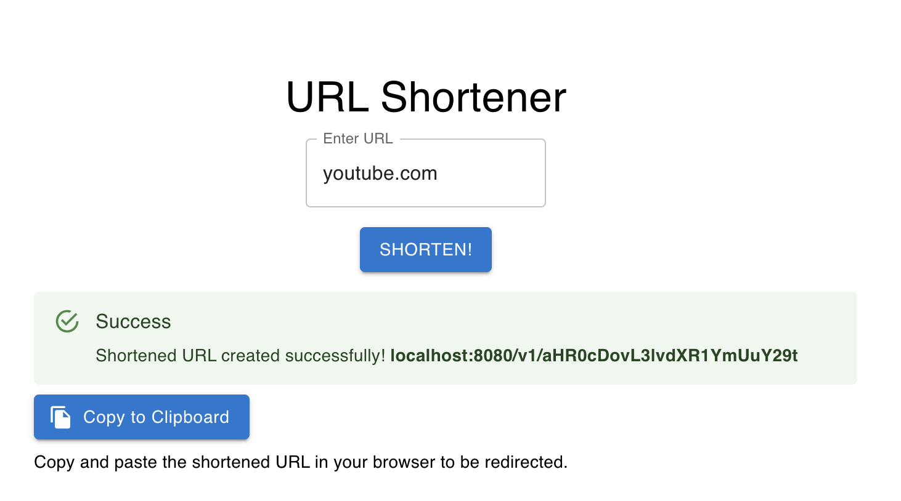

## commands to run the server/api
```bash
go get .
go run .
```

OR 

```bash
go get .
go build
./urlshortener
```
### for running more than 1 file
go run main.go server.go
do note go run main.go will not work as it does not see server.go as part of the same package

## commands to run the frontend
```
cd frontend
npm install
npm start
```


## curl commands to test api
### Create a shortened url
```bash
curl http://localhost:8080/v1/shorten \
    --include \
    --header "Content-Type: application/json" \
    --request "POST" \
    --data '{"longurl": "www.google.com"}'
```

```bash
curl http://localhost:8080/v1/shorten \
    --include \
    --header "Content-Type: application/json" \
    --request "POST" \
    --data '{"longurl": "twitter.com"}'
```

```bash
curl http://localhost:8080/v1/shorten \
    --include \
    --header "Content-Type: application/json" \
    --request "POST" \
    --data '{"longurl": "falsetest not url"}'
```

### Retrieve a long url
- do note here we include the `-i` tag to see the Location headers to see if the redirect works
```bash
curl http://localhost:8080/v1/<insert shortened url>
curl -i http://localhost:8080/v1/aHR0cDovL3d3dy5nb29nbGUuY29t
```


## sql query to make schema
```sql
CREATE TABLE urls (
    id SERIAL PRIMARY KEY,
    shorturl VARCHAR(255) UNIQUE NOT NULL,
    longurl TEXT NOT NULL,
	created_at TIMESTAMP DEFAULT CURRENT_TIMESTAMP
);
```

```sql
SELECT * FROM public.urls
ORDER BY id ASC 
```



## notes on the http codes
404 means the route is not found
200 is a successful http request e.g. if you send a post
500 means exception in the program
302 server is responding with an HTTP Found status code, instructing the client to redirect to the specified longURL.

## notes to import packages within same module
go under go.mod to see your module name
then you can import any of your packages via:
<modulename>/<relative-filepath-from-module-root>

## vs code shortcuts
cmd+P opens the file search bar
cmd+shift+P oepns the vscode command bar, for installing packages etc
cmd+shift+L edits the same words at the same time

## create react project
```
npx create-react-app url-shortener-frontend
cd url-shortener-frontend
```
